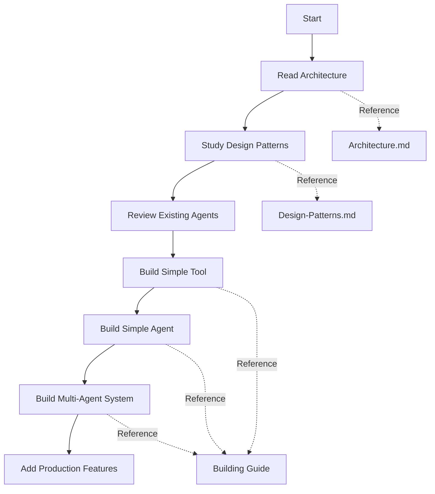

# Multi-Agent System Documentation

This directory contains comprehensive documentation for the multi-agent system architecture built with OpenAI's agents framework.

## 📚 Documentation Index

### [Architecture Overview](./architecture.md)
**Start here for system understanding**

Comprehensive overview of the multi-agent system architecture including:
- System component layers and interactions
- Directory structure and organization
- Agent design patterns and implementations
- Tool implementation patterns
- Session and state management
- Runner execution flow
- Configuration and environment setup
- Extension points and future directions

**Key Diagrams:**
- System architecture layers
- Directory structure
- Agent execution flow
- Session management

**Best for:**
- Understanding overall system design
- Learning component relationships
- Finding where code lives
- Understanding execution model

---

### [Design Patterns](./design-patterns.md)
**Essential patterns and best practices**

Detailed exploration of design patterns used throughout the system:
- Core design patterns (8 fundamental patterns)
- Anti-patterns to avoid (6 common mistakes)
- Design constraints and principles
- Testing patterns
- Evolution patterns (single → multi-agent)

**Key Patterns Covered:**
1. Single Responsibility Agent Pattern
2. Tool Encapsulation Pattern
3. Factory Pattern for Agent Creation
4. Session Continuation Pattern
5. Interactive Loop Pattern
6. Parameter Builder Pattern
7. Async Executor Pattern
8. Error Boundary Pattern

**Best for:**
- Writing new agents and tools
- Understanding why code is structured this way
- Avoiding common mistakes
- Following established conventions

---

### [Building Multi-Agent Systems](./building-multi-agent-systems.md)
**Practical guide to building agents**

Step-by-step guide for building multi-agent systems from scratch:
- System evolution stages (1-5)
- Building your first agent (complete walkthrough)
- Tool development guide (patterns + templates)
- Multi-agent coordination (4 approaches)
- Advanced patterns (context, structured output, guardrails)
- Production considerations (error handling, rate limiting, monitoring)

**Includes:**
- Complete code templates
- Testing strategies
- Production-ready patterns
- Configuration management
- Best practices checklist

**Best for:**
- Building new agents from scratch
- Understanding how to coordinate multiple agents
- Production deployment
- Scaling and maintaining systems

---

### [SmartRouter Guide](./smart-router.md)
**✨ NEW: Intelligent agent routing system with instructions injection**

Complete guide to the SmartRouter - an intelligent orchestration agent that automatically routes queries to specialists:
- Architecture and component design
- Configuration system (YAML-based with instructions injection)
- AgentBuilder pattern for clean agent construction
- Dependency injection and registry pattern
- SOLID principles in action
- Usage guide and examples
- Adding new agents (no code changes!)
- Troubleshooting and testing

**Key Features:**
- Automatic query routing
- **Instructions as configuration** (system prompts in YAML)
- Configuration-driven (add agents via YAML)
- AgentBuilder pattern for consistent agent creation
- Clean architecture (SOLID principles)
- Temperature intelligence (auto-handles reasoning models)
- Lazy loading and caching
- Production-ready

**Best for:**
- Understanding the SmartRouter system
- Adding new agents to the router
- Customizing routing behavior and prompts
- Production deployment
- A/B testing different prompts

---

## 🗺️ Navigation Guide

### I want to...

#### **Understand the system**
→ Start with [Architecture Overview](./architecture.md)

#### **Build a new agent**
→ Follow [Building Multi-Agent Systems](./building-multi-agent-systems.md) → "Building Your First Agent"

#### **Create new tools**
→ Check [Building Multi-Agent Systems](./building-multi-agent-systems.md) → "Tool Development Guide"

#### **Coordinate multiple agents**
→ Read [Building Multi-Agent Systems](./building-multi-agent-systems.md) → "Multi-Agent Coordination"

#### **Understand why code is structured this way**
→ Study [Design Patterns](./design-patterns.md)

#### **Avoid common mistakes**
→ Review [Design Patterns](./design-patterns.md) → "Anti-Patterns"

#### **Prepare for production**
→ See [Building Multi-Agent Systems](./building-multi-agent-systems.md) → "Production Considerations"

#### **Test my agents**
→ Check both:
- [Design Patterns](./design-patterns.md) → "Testing Patterns"
- [Building Multi-Agent Systems](./building-multi-agent-systems.md) → "Testing Strategy"

#### **Use the SmartRouter**
→ Read [SmartRouter Guide](./smart-router.md) → "Usage Guide"

#### **Add an agent to the router**
→ Follow [SmartRouter Guide](./smart-router.md) → "Adding a New Agent"

#### **Customize routing behavior**
→ See [SmartRouter Guide](./smart-router.md) → "Configuration Guide"

---

## 🏗️ Current System Status

### Implemented: ✅

- **Single-purpose specialized agents**
  - Finance Agent (7 tools)
  - Geo Agent (2 tools)
  - Wikipedia Agent (4 tools)
  - Web Agent (1 tool)

- **SmartRouter orchestration** ✨ NEW
  - Intelligent query routing
  - **Instructions injection** (system prompts in YAML)
  - Configuration-based agent management
  - AgentBuilder pattern
  - Dependency injection throughout
  - Lazy loading and caching
  - YAML-based configuration
  - Temperature intelligence (reasoning model support)

- **Core patterns**
  - Async tool execution
  - Session management
  - Factory pattern for agents
  - Interactive testing loops
  - Parameter building utilities
  - Registry pattern for agent management
  - Builder pattern for complex objects

- **Infrastructure**
  - SQLite session persistence
  - Environment configuration
  - Comprehensive error handling
  - Type-safe tool interfaces
  - Configuration validation
  - Agent lifecycle management

### Future: 🔮

- **Hierarchical Orchestration**
  - Task decomposition
  - Parallel execution
  - Result aggregation

- **Autonomous Collaboration**
  - Peer-to-peer agent communication
  - Dynamic team formation
  - Self-organizing workflows

---

## 📊 System Architecture Overview

```
┌─────────────────────────────────────────────────────────────┐
│                    User Interface Layer                      │
│              (CLI, Interactive Loops, Sessions)              │
└──────────────────────┬──────────────────────────────────────┘
                       │
┌──────────────────────▼──────────────────────────────────────┐
│                 Orchestration Layer (NEW)                    │
│                      SmartRouter                             │
│         (Intelligent query routing to specialists)           │
└──────────────────────┬──────────────────────────────────────┘
                       │
┌──────────────────────▼──────────────────────────────────────┐
│                   Specialist Agent Layer                     │
│    Finance • Geo • Wikipedia • Web • [Future Agents]        │
└──────────────────────┬──────────────────────────────────────┘
                       │
┌──────────────────────▼──────────────────────────────────────┐
│                  Tool/Action Layer                           │
│     Finance Tools • Geo Tools • Wikipedia Tools              │
└──────────────────────┬──────────────────────────────────────┘
                       │
┌──────────────────────▼──────────────────────────────────────┐
│              External Service Layer                          │
│    yfinance API • geopy/ArcGIS • Wikipedia API               │
└──────────────────────────────────────────────────────────────┘

                Supporting Infrastructure:
        ┌────────────────────────────────────────────────┐
        │  Config (agents.yaml) → ConfigLoader           │
        │  AgentRegistry → Dependency Injection          │
        │  AgentBuilder → Clean Agent Construction       │
        │  Instructions Injection → Prompts from YAML    │
        └────────────────────────────────────────────────┘
```

---

## 🧩 Key Concepts

### Agents
Self-contained AI systems with:
- **Name**: Identifier
- **Instructions**: System prompt defining behavior
- **Tools**: Functions the agent can call
- **Handoffs**: Other agents it can delegate to

### Tools
Async functions decorated with `@function_tool`:
- Full type hints
- Comprehensive docstrings (LLM reads these!)
- Parameter validation
- Error handling
- Structured returns

### Sessions
Persistent conversation state:
- SQLiteSession for storage
- Maintains context across turns
- Thread-safe
- Lightweight

### Runner
Execution engine:
- Manages agent-LLM interaction loop
- Handles tool calls
- Coordinates handoffs
- Enforces max turns limit

---

## 💡 Quick Start Examples

### Use the SmartRouter (Recommended)

```python
import asyncio
from asdrp.agents.routing import create_smart_router
from agents import SQLiteSession

async def main():
    # Create router - automatically loads all agents
    router = create_smart_router()
    session = SQLiteSession(session_id="my_session")

    # Router automatically selects the right agent
    result = await router.route(
        "What's the stock price of AAPL?",
        session=session
    )

    print(result.final_output)

asyncio.run(main())
```

### Run a specific agent directly

```python
import asyncio
from agents import Runner, SQLiteSession
from asdrp.agents.singles.finance_agent import create_finance_agent

async def main():
    agent = create_finance_agent()
    session = SQLiteSession(session_id="my_session")

    result = await Runner.run(
        agent,
        input="What's the stock price of AAPL?",
        session=session
    )

    print(result.final_output)

asyncio.run(main())
```

### Create a simple tool

```python
from agents import function_tool
import asyncio

@function_tool
async def greet(name: str) -> str:
    """Greet a person by name."""
    return f"Hello, {name}!"

# Test it
result = await greet.on_invoke_tool(
    ctx=None,
    input='{"name": "World"}'
)
print(result)  # "Hello, World!"
```

### Create a simple agent

```python
from agents import Agent, Runner, SQLiteSession

def create_greeter_agent() -> Agent:
    return Agent(
        name="Greeter Agent",
        instructions="You are a friendly greeting agent.",
        tools=[greet],
    )

agent = create_greeter_agent()
session = SQLiteSession(session_id="test")

result = await Runner.run(
    agent,
    input="Greet Alice",
    session=session
)
```

---

## 🔧 Technology Stack

- **Framework**: OpenAI agents (>=0.5.1)
- **Language**: Python 3.13+
- **Async**: asyncio, async/await
- **Session Storage**: SQLite
- **External APIs**:
  - yfinance (financial data)
  - geopy + ArcGIS (geocoding)
  - Wikipedia (knowledge base)
  - OpenAI WebSearch (web search)

---

## 📖 Additional Resources

### Code Examples
- `asdrp/agents/singles/` - Agent implementations
- `asdrp/actions/` - Tool implementations
- Each agent file has a `main()` function with examples

### OpenAI Agents Documentation
- [OpenAI Agents Framework](https://platform.openai.com/docs/guides/agents)
- [Agent Handoffs](https://platform.openai.com/docs/guides/agent-handoffs)
- [Function Tools](https://platform.openai.com/docs/guides/function-calling)

### Testing
- Unit tests: Test individual tools
- Integration tests: Test agent workflows
- E2E tests: Test multi-agent coordination

---

## 🤝 Contributing

When adding new agents or tools:

1. **Follow existing patterns** (see [Design Patterns](./design-patterns.md))
2. **Use factories for agents** (see examples in `agents/singles/`)
3. **Write comprehensive docstrings** (LLM reads them!)
4. **Add tests** (unit + integration)
5. **Document your work** (update relevant docs)

---

## 📝 Conventions

### File Naming
- Agents: `<domain>_agent.py`
- Tools: `<domain>_tools.py`
- Utilities: `<purpose>_utils.py`

### Function Naming
- Tools: `verb_noun` (e.g., `get_ticker_info`, `search_wikipedia`)
- Factories: `create_<domain>_agent`
- Tests: `test_<what>_<condition>`

### Directory Structure
```
asdrp/
├── actions/          # Tools organized by domain
│   └── <domain>/
│       └── <domain>_tools.py
├── agents/
│   ├── routing/      # Orchestration agents
│   └── singles/      # Single-purpose agents
│       └── <domain>_agent.py
└── util/             # Shared utilities
    └── <purpose>_utils.py
```

---

## 🎯 Learning Path



1. **Week 1**: Understand architecture and patterns
2. **Week 2**: Build first tool and agent
3. **Week 3**: Coordinate multiple agents
4. **Week 4**: Add production features

---

## ❓ FAQ

**Q: When should I create a new agent vs. adding tools to existing agent?**
A: Create a new agent when you have a distinct domain with its own set of tools. Add tools when extending an existing domain.

**Q: How do I choose between manual routing and automatic routing?**
A: Start with manual (Stage 2), move to automatic routing (Stage 3) when you have 3+ agents and users don't know which to choose.

**Q: Should all tools be async?**
A: Yes! Use `run_in_executor()` for blocking operations.

**Q: How do I test agents?**
A: Unit test tools individually, integration test agent workflows, E2E test multi-agent coordination.

**Q: What's the difference between instructions and tool docstrings?**
A: Instructions guide agent behavior. Tool docstrings teach agent when/how to use each tool. Both are critical!

---

## 📞 Support

- **Issues**: Check implementation in `asdrp/` directory
- **Questions**: Review documentation in this `docs/` directory
- **Examples**: Look at `main()` functions in agent files
- **Patterns**: See [Design Patterns](./design-patterns.md)

---

**Last Updated**: 2025-12-06
**Version**: 0.1.0
**Status**: Active Development
