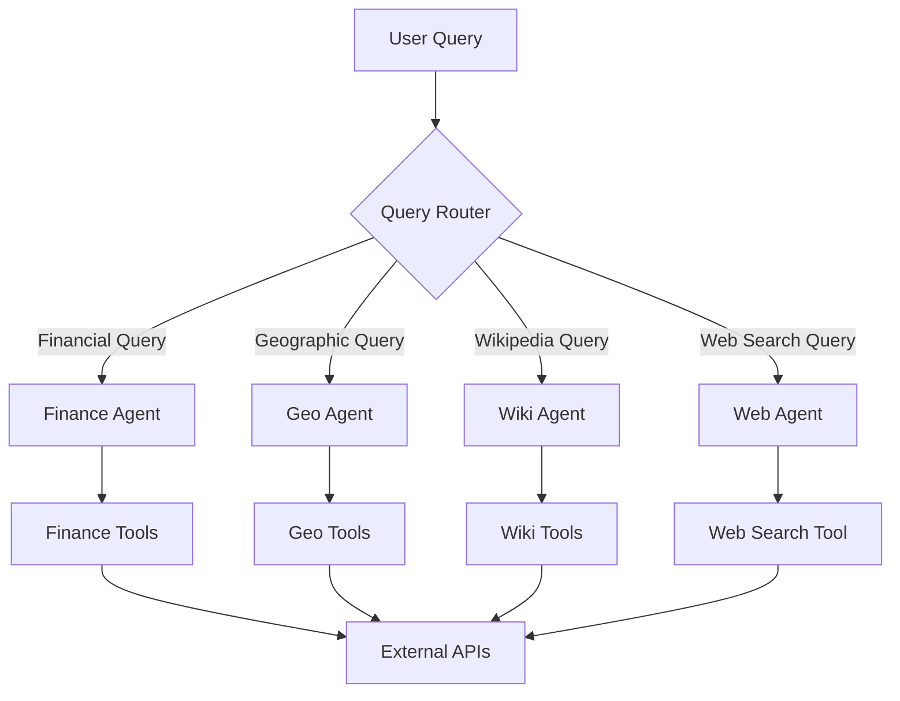
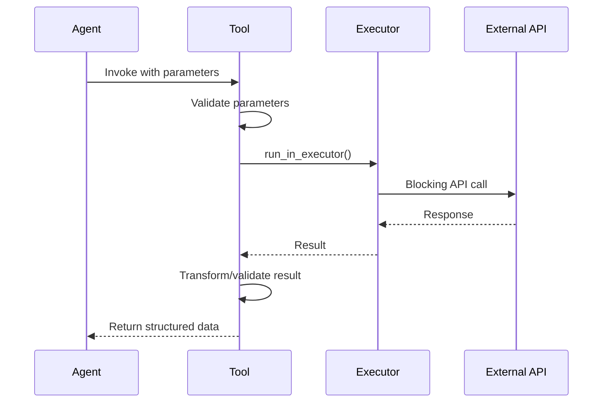
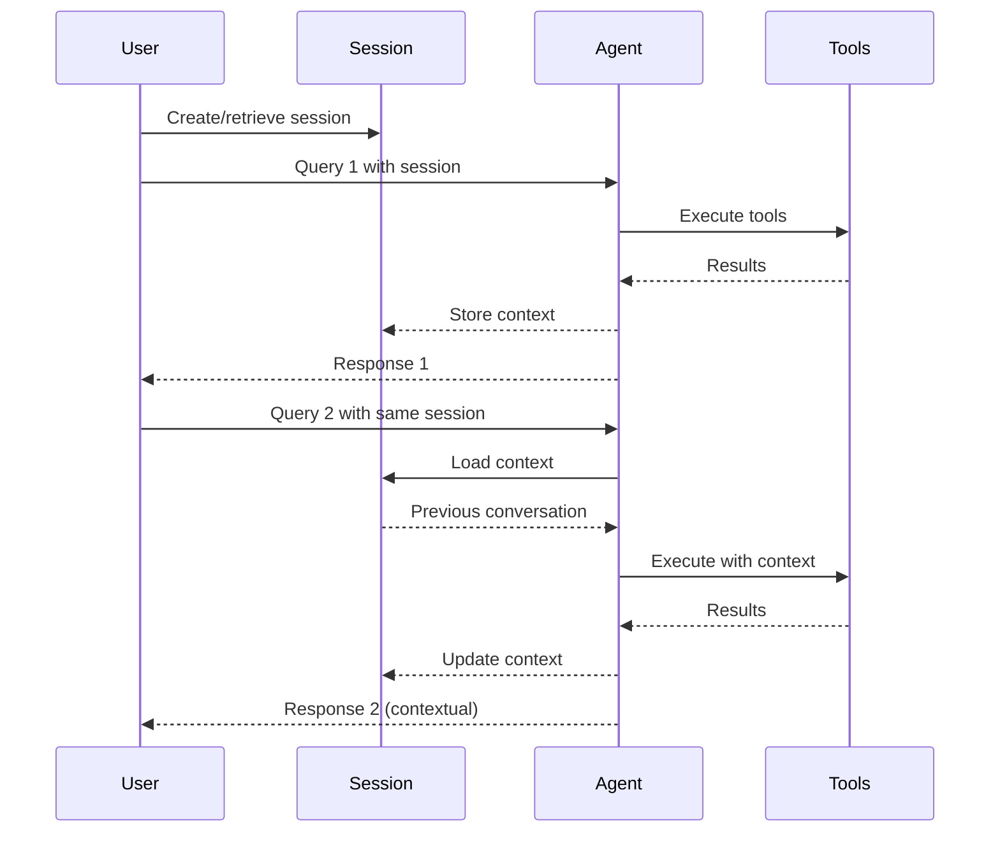
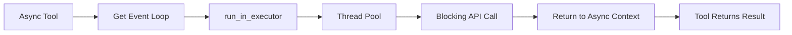
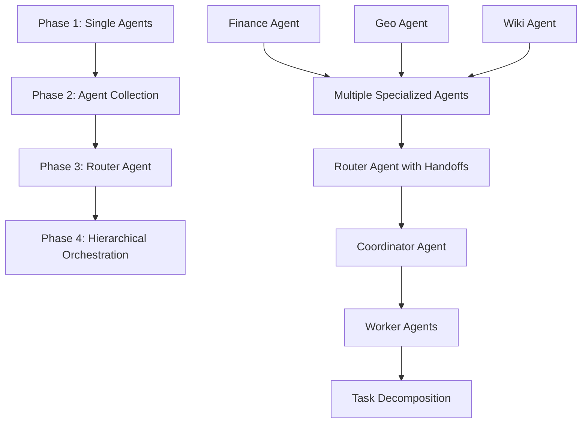

# Multi-Agent System Design Patterns

## Core Design Patterns

### 1. Single Responsibility Agent Pattern

Each agent has a single, well-defined domain of responsibility.



**Benefits:**
- Clear separation of concerns
- Easy to test and maintain
- Simple to understand and extend
- Reduced cognitive load
- Independent scaling

**Implementation:**
```python
# Each agent focuses on ONE domain
finance_agent = Agent(
    name="Finance Agent",
    instructions="Stock market data specialist",
    tools=[get_ticker_info, get_historical_data, ...]
)

geo_agent = Agent(
    name="Geo Agent",
    instructions="Geographic information specialist",
    tools=[get_coordinates_by_address, get_address_by_coordinates]
)
```

### 2. Tool Encapsulation Pattern

Tools are self-contained, async functions with comprehensive documentation.



**Characteristics:**
```python
@function_tool
async def example_tool(
    required_param: str,
    optional_param: Optional[int] = None
) -> Dict[str, Any]:
    """
    Clear, comprehensive description for LLM.

    Args:
        required_param: What this parameter does
        optional_param: Optional configuration

    Returns:
        Dictionary containing structured results

    Raises:
        ValueError: When validation fails
        Exception: When API call fails
    """
    # 1. Validate inputs
    if not required_param:
        raise ValueError("Parameter required")

    # 2. Execute asynchronously
    loop = asyncio.get_running_loop()
    result = await loop.run_in_executor(
        None,
        blocking_api_call,
        required_param
    )

    # 3. Transform and return
    return transform_result(result)
```

### 3. Factory Pattern with Dependency Injection

Agents are created through factory functions with dependency injection support.

```python
from typing import Optional
from asdrp.agents.base import AgentBuilder

# Default instructions (fallback)
DEFAULT_INSTRUCTIONS = """
Detailed instructions that define:
- Agent's purpose and capabilities
- How to use available tools
- Expected behavior patterns
- Tips for optimal performance
""".strip()

# Tools list
DOMAIN_TOOLS = [tool1, tool2, tool3]

def create_domain_agent(
    model: str = "gpt-4.1-mini",
    temperature: Optional[float] = 0.0,
    instructions: Optional[str] = None
) -> Agent:
    """
    Factory function with dependency injection.

    Args:
        model: LLM model to use (injected from config)
        temperature: Temperature setting (injected from config)
        instructions: System prompt (injected from config, falls back to default)

    Returns:
        Configured Agent instance
    """
    return AgentBuilder.create(
        name="Domain Agent",
        instructions=instructions or DEFAULT_INSTRUCTIONS,
        tools=DOMAIN_TOOLS,
        model=model,
        temperature=temperature,
    )
```

**Benefits:**
- Consistent agent configuration
- Full dependency injection (model, temperature, instructions)
- Instructions as configuration data, not code
- Easy to test (inject dependencies)
- Configuration can be externalized
- Simple to version and modify
- Zero-code updates via config changes

### 4. Session Continuation Pattern

Maintain conversation context across multiple interactions.



**Implementation:**
```python
# Create session once per conversation
session = SQLiteSession(session_id="conversation_123")

# First interaction
result1 = await Runner.run(
    agent,
    input="What's AAPL stock price?",
    session=session
)

# Second interaction maintains context
result2 = await Runner.run(
    agent,
    input="What about its historical performance?",  # "its" refers to AAPL
    session=session
)
```

### 5. Interactive Loop Pattern

Standard pattern for testing and user interaction.

```python
async def main():
    # Initialize
    agent = create_agent()
    session = SQLiteSession(session_id="1234")

    # Initial test
    print("Testing with initial query...")
    result = await Runner.run(
        agent,
        input="Initial test query",
        session=session
    )
    print(result.final_output)

    # Interactive loop
    user_input = input("Ask Agent: ")
    while user_input.strip() != "":
        result = await Runner.run(
            agent,
            input=user_input,
            session=session
        )
        print(result.final_output)
        user_input = input("Ask Agent: ")

if __name__ == "__main__":
    asyncio.run(main())
```

### 6. Parameter Builder Pattern

Clean parameter dictionaries using utility functions.

```python
# Problem: Optional parameters create verbose code
params = {
    'symbol': symbol,
    'period': period if period else '1mo',
    'interval': interval if interval else '1d',
}
if start:
    params['start'] = start
if end:
    params['end'] = end

# Solution: Use parameter builder
params = DictUtils.build_params(
    symbol=symbol,
    period=period,
    interval=interval,
    start=start,  # Automatically filtered if None
    end=end,      # Automatically filtered if None
)
```

**Advanced Usage:**
```python
# Include zero values (e.g., for counts)
params = DictUtils.build_params(
    name="test",
    count=0,
    include_zero=True
)
# Result: {'name': 'test', 'count': 0}

# Custom filtering
params = DictUtils.build_params(
    a=1,
    b=None,
    c="",
    filter_func=lambda v: v is not None
)
# Result: {'a': 1, 'c': ''}
```

### 7. Async Executor Pattern

Handle blocking I/O in async context.



**Pattern:**
```python
@function_tool
async def blocking_io_tool(param: str) -> Result:
    loop = asyncio.get_running_loop()

    # Simple function
    result = await loop.run_in_executor(
        None,  # Use default executor
        blocking_function,
        param
    )

    # Lambda for complex calls
    result = await loop.run_in_executor(
        None,
        lambda: object.method(param1, param2)
    )

    # functools.partial for multiple parameters
    from functools import partial
    call = partial(complex_function, param1, param2, kwarg=value)
    result = await loop.run_in_executor(None, call)

    return result
```

### 8. Instructions Injection Pattern

Move system prompts from code to configuration for flexibility.

**Before (Hardcoded):**
```python
def create_finance_agent() -> Agent:
    return Agent(
        name="Finance Agent",
        instructions="You are a financial analyst...",  # ❌ Hardcoded
        tools=[...],
    )
```

**After (Injected):**
```python
# In agent file - default fallback
DEFAULT_INSTRUCTIONS = """
You are a financial analyst...
""".strip()

def create_finance_agent(
    model: str = "gpt-4.1-mini",
    temperature: Optional[float] = 0.0,
    instructions: Optional[str] = None  # ✨ Injected parameter
) -> Agent:
    return AgentBuilder.create(
        name="Finance Agent",
        instructions=instructions or DEFAULT_INSTRUCTIONS,  # ✅ Uses config or default
        tools=FINANCE_TOOLS,
        model=model,
        temperature=temperature,
    )
```

**In Configuration (config/agents.yaml):**
```yaml
agents:
  - id: finance
    name: Finance Agent
    model: gpt-4.1-mini
    temperature: 0.0
    instructions: |
      You are a financial analyst expert...
      [Full system prompt - editable without code changes!]
```

**Registry Injection Logic:**
```python
# AgentRegistry extracts and injects parameters
kwargs = {}
if agent_config.get("model"):
    kwargs["model"] = agent_config["model"]
if agent_config.get("temperature") is not None:
    kwargs["temperature"] = agent_config["temperature"]
if agent_config.get("instructions"):
    kwargs["instructions"] = agent_config["instructions"]

# Creates partial function with pre-filled parameters
factory = partial(base_factory, **kwargs)
```

**Benefits:**
- **Zero-Code Updates**: Modify agent behavior via YAML
- **A/B Testing**: Easy to test different prompts
- **Environment-Specific**: Different configs for dev/staging/prod
- **Version Control**: Track prompt changes in git
- **Centralized**: All prompts in one configuration file
- **Separation of Concerns**: Logic in code, behavior in config

### 9. AgentBuilder Pattern

Consistent agent construction with temperature intelligence.

```python
from asdrp.agents.base import AgentBuilder

# Static factory method (simplest)
agent = AgentBuilder.create(
    name="My Agent",
    instructions="You are helpful.",
    tools=[tool1, tool2],
    model="gpt-4.1-mini",
    temperature=0.0
)

# Builder pattern (fluent interface)
agent = (AgentBuilder()
    .with_name("My Agent")
    .with_instructions("You are helpful.")
    .with_tools([tool1, tool2])
    .with_model("gpt-4.1-mini", temperature=0.0)
    .build())
```

**Temperature Intelligence:**
```python
# Automatically handles reasoning models that don't support temperature
agent = AgentBuilder.create(
    name="Reasoning Agent",
    instructions="Think step by step.",
    tools=[...],
    model="o1-mini",
    temperature=None  # Reasoning models don't support temperature
)
# AgentBuilder detects o1/o3 models and skips ModelSettings creation
```

**Benefits:**
- **Consistent Construction**: All agents built the same way
- **Temperature Intelligence**: Auto-handles reasoning models (o1, o3)
- **ModelSettings Management**: Properly creates and applies settings
- **Flexible Interface**: Both static factory and builder patterns
- **Type Safety**: Full type hints throughout

### 10. Error Boundary Pattern

Consistent error handling across tools.

```python
@function_tool
async def resilient_tool(param: str) -> Dict[str, Any]:
    # 1. Input validation
    if not param or not param.strip():
        raise ValueError("Parameter cannot be empty")

    # 2. Business logic validation
    if not is_valid_format(param):
        raise ValueError(f"Invalid format: {param}")

    # 3. API execution with error handling
    try:
        loop = asyncio.get_running_loop()
        result = await loop.run_in_executor(None, api_call, param)

        # 4. Result validation
        if not result:
            return {"error": "No data found", "param": param}

        return {"success": True, "data": result}

    except SpecificAPIError as e:
        # Handle known errors
        return {"error": f"API error: {e}", "param": param}

    except Exception as e:
        # Log and re-raise unexpected errors
        logger.error(f"Unexpected error in tool: {e}")
        raise Exception(f"Failed to process '{param}': {e}")
```

## Anti-Patterns to Avoid

### ❌ Multi-Purpose Agents

```python
# BAD: One agent trying to do everything
super_agent = Agent(
    name="Super Agent",
    instructions="Handle finance, geo, and wiki queries",
    tools=[*finance_tools, *geo_tools, *wiki_tools]
)
```

**Problems:**
- Confusion about which tool to use
- Poor performance on specific tasks
- Difficult to maintain and test
- Large context window usage

### ❌ Blocking I/O in Async Functions

```python
# BAD: Blocking call in async function
@function_tool
async def bad_tool(symbol: str):
    # This blocks the event loop!
    result = blocking_api_call(symbol)
    return result

# GOOD: Use executor
@function_tool
async def good_tool(symbol: str):
    loop = asyncio.get_running_loop()
    result = await loop.run_in_executor(None, blocking_api_call, symbol)
    return result
```

### ❌ Ignoring Parameter Validation

```python
# BAD: No validation
@function_tool
async def unsafe_tool(param: str):
    return api_call(param)  # Can fail with cryptic errors

# GOOD: Validate inputs
@function_tool
async def safe_tool(param: str):
    if not param or not param.strip():
        raise ValueError("Parameter cannot be empty")
    return api_call(param.strip())
```

### ❌ Poor Docstrings

```python
# BAD: Minimal description
@function_tool
async def bad_tool(symbol: str):
    """Get stock info."""
    return get_info(symbol)

# GOOD: Comprehensive documentation
@function_tool
async def good_tool(symbol: str) -> Dict[str, Any]:
    """
    Get comprehensive stock information from Yahoo Finance.

    Retrieves company details, financial metrics, and key statistics.
    Use this for general company information before drilling into
    specific financials or historical data.

    Args:
        symbol: Stock ticker symbol (e.g., 'AAPL', 'MSFT', 'GOOGL').
            Must be uppercase and a valid symbol.

    Returns:
        Dictionary containing:
            - Company name and sector
            - Market cap and enterprise value
            - Financial ratios (P/E, EPS, etc.)
            - Business summary

    Raises:
        ValueError: If symbol is empty or invalid format.
        Exception: If Yahoo Finance API call fails.

    Example:
        >>> result = await good_tool("AAPL")
        >>> print(result['longName'])
        'Apple Inc.'
    """
    ...
```

### ❌ Session Per Request

```python
# BAD: New session for each request loses context
for query in queries:
    session = SQLiteSession(session_id=str(uuid.uuid4()))  # New session!
    result = await Runner.run(agent, input=query, session=session)

# GOOD: Reuse session for conversation continuity
session = SQLiteSession(session_id="conversation_123")
for query in queries:
    result = await Runner.run(agent, input=query, session=session)
```

### ❌ Hardcoded Instructions

```python
# BAD: Instructions hardcoded in agent creation
def create_agent() -> Agent:
    return Agent(
        name="My Agent",
        instructions="You are a helpful assistant...",  # ❌ Hardcoded
        tools=[...],
    )
# Problem: Must modify code to change behavior

# GOOD: Instructions injected from config
DEFAULT_INSTRUCTIONS = """
You are a helpful assistant...
""".strip()

def create_agent(
    model: str = "gpt-4.1-mini",
    temperature: Optional[float] = 0.0,
    instructions: Optional[str] = None  # ✅ Injectable
) -> Agent:
    return AgentBuilder.create(
        name="My Agent",
        instructions=instructions or DEFAULT_INSTRUCTIONS,
        tools=TOOLS,
        model=model,
        temperature=temperature,
    )
# Benefit: Change behavior via config, not code
```

## Design Constraints and Principles

### 1. Immutability
- Tools return new objects, never modify inputs
- DictUtils methods return new dictionaries
- Agents are stateless (state in session)

### 2. Type Safety
- Full type hints on all functions
- Return types specified for LLM understanding
- Use TypedDict or Pydantic for complex returns

### 3. Async First
- All tools are async
- Use executors for blocking I/O
- Never block the event loop

### 4. Comprehensive Documentation
- LLM reads docstrings to understand tools
- Include examples in docstrings
- Document edge cases and errors

### 5. Single Source of Truth
- Agent instructions define behavior
- Docstrings define tool usage
- Configuration in one place (factory or config file)

### 6. Fail Fast
- Validate inputs immediately
- Raise meaningful exceptions
- Don't return None for errors

### 7. Separation of Concerns
```
Agents     → Orchestration & decision making
Tools      → Business logic & data access
Utilities  → Cross-cutting concerns
External   → Third-party integrations
```

## Testing Patterns

### Unit Testing Tools

```python
import pytest
from unittest.mock import AsyncMock, patch

@pytest.mark.asyncio
async def test_tool_success():
    # Test successful execution
    result = await tool.on_invoke_tool(
        ctx=None,
        input=json.dumps({"param": "value"})
    )
    parsed = json.loads(result)
    assert parsed["data"] is not None

@pytest.mark.asyncio
async def test_tool_validation():
    # Test parameter validation
    with pytest.raises(ValueError):
        await tool.on_invoke_tool(
            ctx=None,
            input=json.dumps({"param": ""})
        )

@pytest.mark.asyncio
async def test_tool_with_mock():
    # Test with mocked external API
    with patch('module.external_api') as mock_api:
        mock_api.return_value = {"test": "data"}
        result = await tool.on_invoke_tool(
            ctx=None,
            input=json.dumps({"param": "value"})
        )
        assert "test" in json.loads(result)
```

### Integration Testing Agents

```python
@pytest.mark.asyncio
async def test_agent_workflow():
    agent = create_agent()
    session = SQLiteSession(session_id="test")

    result = await Runner.run(
        agent,
        input="Test query",
        session=session
    )

    assert result.final_output is not None
    assert len(result.final_output) > 0
```

## Evolution Patterns

### From Single to Multi-Agent



This architecture is currently in **Phase 2**, ready for **Phase 3**.
