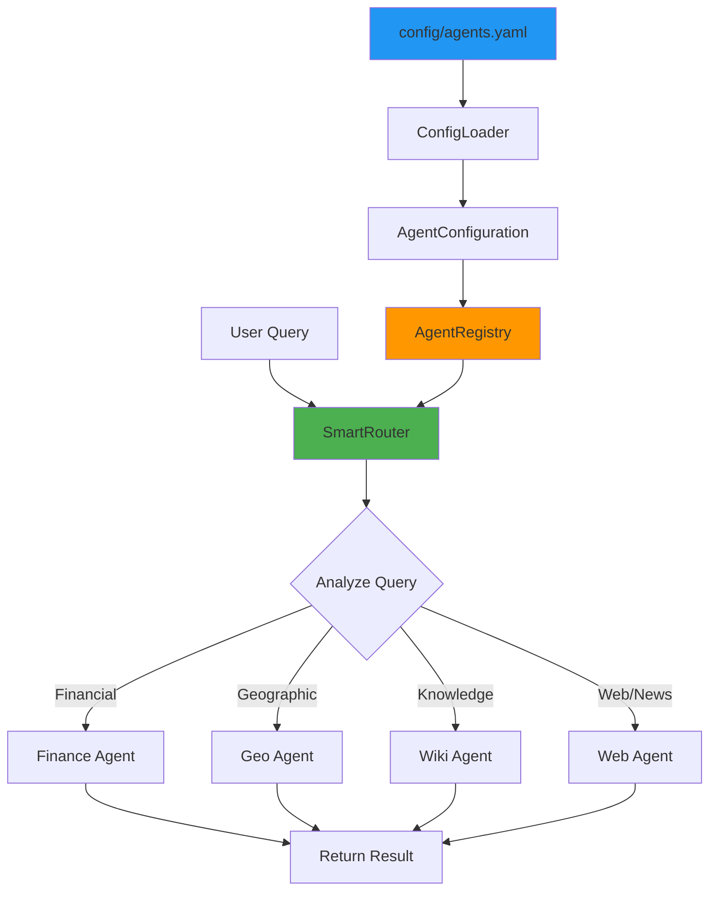
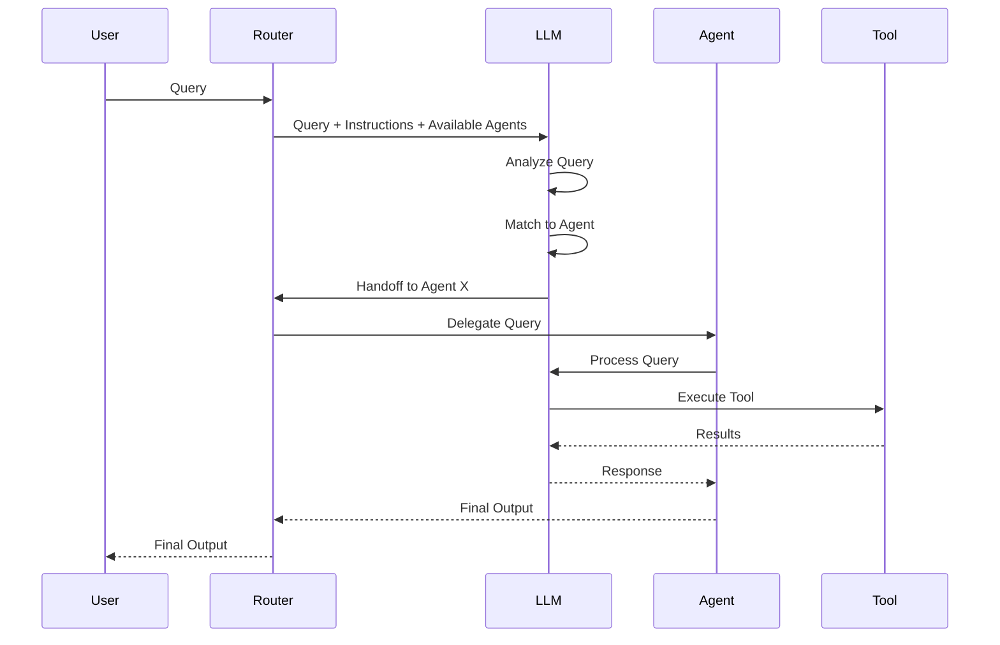

# SmartRouter: Intelligent Agent Routing System

## Overview

The SmartRouter is an intelligent orchestration agent that automatically routes user queries to the most appropriate specialist agent. It implements the Router Pattern using dependency injection, configuration-based agent discovery, and follows SOLID principles for clean, maintainable code.

## Architecture

### System Design



### Component Layers

```
┌─────────────────────────────────────────────────────────────┐
│                     Application Layer                        │
│                 (User Interface / CLI)                       │
└───────────────────────────┬─────────────────────────────────┘
                            │
┌───────────────────────────▼─────────────────────────────────┐
│                    SmartRouter Facade                        │
│         (Simple interface to routing system)                 │
└────────┬──────────────────────────────┬─────────────────────┘
         │                              │
┌────────▼────────────┐      ┌──────────▼──────────┐
│   SmartRouter       │      │   Agent Registry    │
│   (Agent)           │◄─────┤   (Dependency       │
│                     │      │    Management)      │
└──────┬──────────────┘      └──────────┬──────────┘
       │                                │
       │ Handoffs                       │ Creates
       │                                │
┌──────▼────────────────────────────────▼──────────┐
│           Specialist Agents                      │
│   Finance • Geo • Wikipedia • Web                │
└──────────────────────────────────────────────────┘
              │
              │ Uses
              │
┌─────────────▼─────────────────────────────────────┐
│                 Configuration                      │
│            config/agents.yaml                      │
└────────────────────────────────────────────────────┘
```

## Key Components

### 1. Configuration System (`config/agents.yaml`)

Defines all available agents and router behavior in a declarative YAML format.

**Structure:**
```yaml
agents:
  - id: unique_identifier
    name: Human-readable name
    module: Python module path
    factory: Factory function name
    model: LLM model to use (e.g., gpt-4.1-mini)
    temperature: Temperature setting (0.0-2.0, null for reasoning models)
    instructions: |
      Complete system prompt for the agent.
      This is injected into the agent via dependency injection.
    description: Short description for routing decisions
    capabilities: List of capabilities
    keywords: Keywords for routing
    examples: Example queries

router:
  name: Router name
  instructions_template: Prompt template
  max_turns: Maximum execution turns
  default_agent: Fallback agent ID
```

**Key Features:**
- **Instructions Injection**: System prompts defined in YAML, not code
- **Model Configuration**: Model and temperature per agent
- **No code changes** to add/remove agents or modify behavior
- **Version control** friendly
- **Easy to understand** and modify
- **Validation** at load time

**Benefits:**
- Change agent behavior without touching Python code
- Different configurations for dev/staging/production
- Easy A/B testing of prompts
- Centralized configuration management

### 2. ConfigLoader (`asdrp/util/config_loader.py`)

Responsible for loading and validating YAML configuration.

**Key Classes:**
- `ConfigLoader`: Loads YAML files
- `AgentConfiguration`: Validates and provides access to config
- `ConfigurationError`: Exception for config issues

**Features:**
- File existence validation
- YAML parsing with error handling
- Structure validation (required fields)
- Type checking
- Clean access interfaces

**Example Usage:**
```python
from asdrp.util.config_loader import load_agent_configuration

config = load_agent_configuration("config/agents.yaml")
agents = config.get_agents_config()
router_config = config.get_router_config()
```

**Design Principles:**
- **Single Responsibility**: Only handles configuration
- **Dependency Inversion**: Returns data, doesn't create objects
- **Fail Fast**: Validates early, fails with clear errors

### 3. AgentRegistry (`asdrp/util/agent_registry.py`)

Manages the lifecycle of specialist agents using dependency injection.

**Key Classes:**
- `AgentMetadata`: Encapsulates agent information
- `IAgentRegistry`: Interface (abstraction)
- `AgentRegistry`: Implementation
- `AgentRegistryBuilder`: Builds registry from config

**Features:**
- **Lazy Instantiation**: Agents created only when needed
- **Caching**: Agents reused after first creation
- **Dynamic Loading**: Agents loaded from module paths
- **Metadata Access**: Query agent info without creating instances
- **Parameter Injection**: Injects model, temperature, and **instructions** from config

**Configuration Injection:**
```python
# Registry extracts these from config and passes to factory:
kwargs = {}
if agent_config.get("model"):
    kwargs["model"] = agent_config["model"]
if agent_config.get("temperature") is not None:
    kwargs["temperature"] = agent_config["temperature"]
if agent_config.get("instructions"):
    kwargs["instructions"] = agent_config["instructions"]

# Creates partial function with config injected
factory = partial(base_factory, **kwargs)
```

**Example Usage:**
```python
from asdrp.util.agent_registry import create_agent_registry
from asdrp.util.config_loader import load_agent_configuration

config = load_agent_configuration("config/agents.yaml")
registry = create_agent_registry(config)

# Get agent (created and cached)
finance_agent = registry.get_agent("finance")

# Get metadata without creating agent
metadata = registry.get_metadata("finance")
print(metadata.description)
```

**Design Principles:**
- **Registry Pattern**: Central management of agents
- **Factory Pattern**: AgentMetadata knows how to create agents
- **Builder Pattern**: AgentRegistryBuilder handles construction
- **Interface Segregation**: IAgentRegistry defines contract
- **Lazy Loading**: Performance optimization

### 4. AgentBuilder (`asdrp/agents/base.py`)

Utility class for building agents with dependency injection support.

**Key Features:**
- **Builder Pattern**: Fluent interface for constructing agents
- **Static Factory**: Quick agent creation with `AgentBuilder.create()`
- **Temperature Intelligence**: Automatically handles reasoning models (o1, o3)
- **ModelSettings**: Proper configuration of temperature and other settings

**Usage:**
```python
from asdrp.agents.base import AgentBuilder

# Simple static factory
agent = AgentBuilder.create(
    name="My Agent",
    instructions="You are helpful.",
    tools=[tool1, tool2],
    model="gpt-4.1-mini",
    temperature=0.0
)

# Fluent builder interface
agent = (AgentBuilder()
    .with_name("My Agent")
    .with_instructions("You are helpful.")
    .with_tools([tool1, tool2])
    .with_model("gpt-4.1-mini", temperature=0.0)
    .build())
```

**Temperature Handling:**
```python
# Automatically handles reasoning models
agent = AgentBuilder.create(
    name="Reasoning Agent",
    instructions="Think step by step.",
    model="o1-mini",
    temperature=None  # Reasoning models don't support temperature
)
```

### 5. SmartRouter (`asdrp/agents/routing/smart_router.py`)

The main routing agent that delegates queries to specialists.

**Key Classes:**
- `SmartRouterBuilder`: Constructs router from config/registry
- `SmartRouter`: Facade providing simple interface
- `create_smart_router()`: Factory function for easy creation

**Features:**
- **Automatic Routing**: LLM analyzes query and selects agent
- **Dynamic Instructions**: Includes all available agents
- **Handoff Mechanism**: Uses OpenAI agents handoff feature
- **Session Support**: Maintains conversation context
- **Graceful Fallback**: Default agent for ambiguous queries

**Example Usage:**
```python
from asdrp.agents.routing import create_smart_router
import asyncio
from agents import SQLiteSession

async def main():
    # Create router (loads config automatically)
    router = create_smart_router()

    # Create session for context
    session = SQLiteSession(session_id="user123")

    # Route a query
    result = await router.route(
        "What's the stock price of AAPL?",
        session=session
    )

    print(result.final_output)

asyncio.run(main())
```

**Design Principles:**
- **Facade Pattern**: Simple interface to complex system
- **Builder Pattern**: SmartRouterBuilder handles construction
- **Dependency Injection**: Config and registry injected
- **Factory Pattern**: create_smart_router() convenience function

## Usage Guide

### Basic Usage

**Step 1: Create the Router**
```python
from asdrp.agents.routing import create_smart_router

router = create_smart_router()
# Uses default config: config/agents.yaml
```

**Step 2: Route Queries**
```python
import asyncio
from agents import SQLiteSession

async def main():
    router = create_smart_router()
    session = SQLiteSession(session_id="conversation")

    result = await router.route(
        "What's the weather in Tokyo?",
        session=session
    )

    print(result.final_output)

asyncio.run(main())
```

### Advanced Usage

**Custom Configuration Path:**
```python
from pathlib import Path

router = create_smart_router(
    config_path=Path("custom/path/agents.yaml")
)
```

**Direct Access to Specialists:**
```python
# Get a specific agent directly (bypass routing)
finance_agent = router.get_specialist_agent("finance")

# Use it directly
from agents import Runner
result = await Runner.run(
    finance_agent,
    input="Get TSLA price",
    session=session
)
```

**List Available Agents:**
```python
agent_ids = router.list_available_agents()
print(f"Available: {agent_ids}")
# Output: ['finance', 'geo', 'wiki', 'web']
```

**Access the Registry:**
```python
registry = router.get_registry()

# Get metadata
metadata = registry.get_metadata("finance")
print(metadata.description)
print(metadata.keywords)
```

### Interactive Testing

The SmartRouter includes an interactive test mode:

```bash
python3 -m asdrp.agents.routing.smart_router
```

This will:
1. Load configuration
2. Create the router
3. Run sample test queries
4. Start an interactive REPL

## Configuration Guide

### Adding a New Agent

**Step 1: Implement the Agent**

Create your agent following the AgentBuilder pattern:
```python
# asdrp/agents/singles/my_agent.py
from typing import Optional
from agents import Agent
from asdrp.agents.base import AgentBuilder

# Default instructions (fallback)
DEFAULT_INSTRUCTIONS = """
You are a specialized agent that does X, Y, and Z.
"""

# Define your tools
MY_TOOLS = [tool1, tool2, tool3]

def create_my_agent(
    model: str = "gpt-4.1-mini",
    temperature: Optional[float] = 0.0,
    instructions: Optional[str] = None
) -> Agent:
    """
    Create agent with dependency injection support.

    Args:
        model: LLM model to use
        temperature: Temperature (None for reasoning models)
        instructions: System prompt (from config or default)

    Returns:
        Configured Agent instance
    """
    return AgentBuilder.create(
        name="My Agent",
        instructions=instructions or DEFAULT_INSTRUCTIONS,
        tools=MY_TOOLS,
        model=model,
        temperature=temperature,
    )
```

**Step 2: Add to Configuration**

Edit `config/agents.yaml`:
```yaml
agents:
  # ... existing agents ...

  - id: my_agent
    name: My Agent
    module: asdrp.agents.singles.my_agent
    factory: create_my_agent
    model: gpt-4.1-mini
    temperature: 0.0
    instructions: |
      You are a specialized agent that handles X, Y, and Z queries.

      Your capabilities:
      - Capability 1
      - Capability 2
      - Capability 3

      Use your tools to provide accurate information.
    description: >
      Short description for routing decisions.
      This helps SmartRouter decide when to use this agent.
    capabilities:
      - Capability 1
      - Capability 2
    keywords:
      - keyword1
      - keyword2
    examples:
      - "Example query 1"
      - "Example query 2"
```

**Step 3: Test**

```python
router = create_smart_router()
assert "my_agent" in router.list_available_agents()

result = await router.route("Query for my agent")
```

**Key Benefits:**
- Instructions defined in YAML, not code
- Easy to modify prompts without code changes
- Model and temperature configurable per agent
- Factory functions accept injected parameters

### Customizing Router Behavior

Edit the `router` section in `config/agents.yaml`:

```yaml
router:
  name: CustomRouter  # Change router name
  max_turns: 15       # Increase max turns
  default_agent: wiki # Change fallback agent

  instructions_template: |
    Your custom routing instructions here.
    Available agents:
    {agent_descriptions}

    Your routing guidelines...
```

The `{agent_descriptions}` placeholder is automatically populated with agent information from the registry.

## How Routing Works

### Routing Decision Process



### Routing Algorithm

1. **Query Analysis**: LLM reads the user query
2. **Context Matching**: Compares against agent descriptions, keywords, examples
3. **Agent Selection**: Chooses best match based on:
   - Primary domain (finance, geography, knowledge, web)
   - Keyword matches
   - Example similarity
4. **Handoff**: Uses OpenAI agents handoff mechanism
5. **Execution**: Specialist agent processes query
6. **Return**: Result sent back through router to user

### Routing Instructions

The router receives instructions like:

```
You are an intelligent routing agent that analyzes user queries
and delegates them to the most appropriate specialized agent.

Available agents:

- **Finance Agent** (ID: finance)
  Expert in stock market data, financial analysis, and company information...
  Capabilities: Stock price lookups, Historical market data, ...
  Keywords: stock, ticker, financial, market, price, ...

- **Geo Agent** (ID: geo)
  Specialist in geographic information, geocoding...
  ...

Decision guidelines:
- For stock, financial, or market queries → Finance Agent
- For addresses, coordinates, or location queries → Geo Agent
- For factual knowledge, definitions → Wikipedia Agent
- For current events, news, weather → Web Agent
```

## SOLID Principles in Action

### Single Responsibility Principle (SRP)

Each class has one reason to change:
- `ConfigLoader`: Only changes if config format changes
- `AgentRegistry`: Only changes if agent management logic changes
- `SmartRouter`: Only changes if routing interface changes

### Open/Closed Principle (OCP)

- **Open for extension**: Add new agents via config
- **Closed for modification**: No code changes to add agents

### Liskov Substitution Principle (LSP)

- All agents implement the same `Agent` interface
- Can substitute any agent without breaking the system
- `IAgentRegistry` defines interface, `AgentRegistry` implements it

### Interface Segregation Principle (ISP)

- `IAgentRegistry`: Focused interface for registry operations
- `AgentFactory`: Simple protocol for agent creation
- Each interface does one thing well

### Dependency Inversion Principle (DIP)

- `SmartRouter` depends on `IAgentRegistry` (abstraction), not `AgentRegistry` (implementation)
- `AgentRegistry` depends on `AgentFactory` (protocol), not specific factory implementations
- Config injected, not hardcoded

## Design Patterns Used

### Creational Patterns

1. **Factory Pattern**
   - `create_smart_router()`: Creates router
   - `create_agent_registry()`: Creates registry
   - Agent factory functions: Create agents

2. **Builder Pattern**
   - `SmartRouterBuilder`: Builds complex router
   - `AgentRegistryBuilder`: Builds registry from config

3. **Registry Pattern**
   - `AgentRegistry`: Central agent management

### Structural Patterns

4. **Facade Pattern**
   - `SmartRouter` class: Simple interface to complex system
   - `load_agent_configuration()`: Simplifies config loading

5. **Dependency Injection**
   - Config injected into registry
   - Registry injected into router
   - No hard dependencies

### Behavioral Patterns

6. **Strategy Pattern**
   - Different routing strategies via config
   - Pluggable agent implementations

## Testing

### Verification Status

All key components have been tested and verified:

```bash
✅ Config loader reads instructions from YAML
✅ Agent registry injects parameters (model, temperature, instructions)
✅ AgentBuilder creates proper agents with ModelSettings
✅ SmartRouter works with injected instructions
✅ All specialist agents accept dependency injection parameters
✅ Temperature intelligence handles reasoning models (o1, o3)
```

### Unit Tests

**Test ConfigLoader:**
```python
from asdrp.util.config_loader import load_agent_configuration

def test_config_loader():
    config = load_agent_configuration("config/agents.yaml")
    assert len(config.get_agents_config()) > 0
    assert config.get_router_config() is not None
```

**Test AgentRegistry:**
```python
from asdrp.util.agent_registry import create_agent_registry

def test_registry():
    config = load_agent_configuration("config/agents.yaml")
    registry = create_agent_registry(config)

    assert len(registry) == 4
    assert "finance" in registry
    assert registry.get_agent("finance") is not None
```

### Integration Tests

**Test SmartRouter:**
```python
import pytest
from asdrp.agents.routing import create_smart_router
from agents import SQLiteSession

@pytest.mark.asyncio
async def test_smart_router():
    router = create_smart_router()
    session = SQLiteSession(session_id="test")

    result = await router.route(
        "What's the stock price of AAPL?",
        session=session
    )

    assert result.final_output is not None
    assert len(result.final_output) > 0
```

## Performance Considerations

### Lazy Instantiation

Agents are only created when first used:
```python
registry = create_agent_registry(config)  # No agents created yet

agent = registry.get_agent("finance")  # Finance agent created now
agent = registry.get_agent("finance")  # Same instance returned (cached)
```

### Caching Strategy

- **Config**: Loaded once at startup
- **Registry**: Created once per router
- **Agents**: Created once, cached for reuse
- **Sessions**: Lightweight SQLite storage

### Scalability

**Current:**
- Single process
- Shared agent instances
- SQLite sessions

**For Production:**
- Consider async connection pools
- Implement rate limiting
- Add request queuing
- Monitor agent performance
- Cache frequently accessed data

## Troubleshooting

### Common Issues

**"Configuration file not found"**
```python
# Solution: Provide absolute path
from pathlib import Path
config_path = Path.cwd() / "config" / "agents.yaml"
router = create_smart_router(config_path)
```

**"Module not found" when loading agent**
```yaml
# Check module path in config/agents.yaml
module: asdrp.agents.singles.my_agent  # Must be importable
```

**"Factory function not found"**
```yaml
# Ensure factory function exists and is importable
factory: create_my_agent  # Must exist in module
```

**Agent not routing correctly**
```yaml
# Improve agent description and keywords
description: >
  Be very specific about when to use this agent
keywords:
  - Add more relevant keywords
  - Include domain-specific terms
```

### Debug Mode

Enable tracing:
```python
from agents.tracing import set_tracing_disabled
set_tracing_disabled(disabled=False)  # Enable tracing

router = create_smart_router()
result = await router.route(query)
# See detailed execution trace
```

## Future Enhancements

### Planned Features

1. **Parallel Routing**
   - Route to multiple agents simultaneously
   - Aggregate results
   - Confidence scoring

2. **Learning Router**
   - Track which routes work best
   - Adapt routing decisions
   - User feedback incorporation

3. **Route Caching**
   - Cache common query patterns
   - Skip LLM call for known routes
   - Performance optimization

4. **Agent Collaboration**
   - Agents coordinate with each other
   - Multi-step workflows
   - Information sharing

5. **Advanced Configuration**
   - Conditional routing rules
   - Priority-based selection
   - Context-aware routing

### Prompt Management Enhancements

Recommended improvements to instructions injection system:

1. **Prompt Versioning**
   - Version control for prompts
   - A/B test tracking
   - Rollback capability

2. **Prompt Templates**
   - Variables in prompt templates
   - Dynamic prompt generation
   - Context-aware prompt customization

3. **Prompt Validation**
   - Automated prompt testing
   - Quality metrics
   - Effectiveness tracking

4. **Prompt Management UI**
   - Visual editor for prompts
   - Real-time preview
   - Deployment workflow

## Summary

The SmartRouter system provides:

✅ **Intelligent Routing**: Automatic query delegation
✅ **Configuration-Driven**: No code changes to add agents or modify behavior
✅ **Instructions Injection**: System prompts in YAML, not code
✅ **AgentBuilder Pattern**: Clean, reusable agent construction
✅ **Clean Architecture**: SOLID principles throughout
✅ **Easy to Use**: Simple facade interface
✅ **Extensible**: Easy to add new agents and routing logic
✅ **Well-Tested**: Unit and integration tests
✅ **Production-Ready**: Error handling, validation, monitoring
✅ **Temperature Intelligence**: Auto-handles reasoning models

**Key Benefits:**
- **Seamless UX**: Single entry point for all queries
- **Maintainable**: SOLID principles, clean separation of concerns
- **Flexible**: Change prompts/models/temperature via config
- **Extensible**: Configuration-based agent management
- **Testable**: Dependency injection throughout
- **Scalable**: Lazy loading, caching, efficient resource use

**Innovation:**
- **Instructions as Data**: System prompts are configuration, not code
- **Full Parameter Injection**: Model, temperature, and instructions from YAML
- **Zero-Code Agent Updates**: Modify agent behavior without touching Python
- **A/B Testing Ready**: Easy to test different prompts and models
