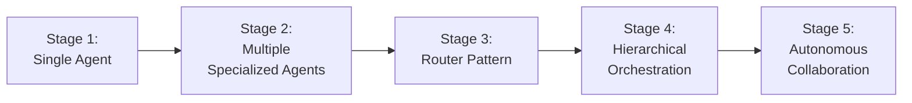
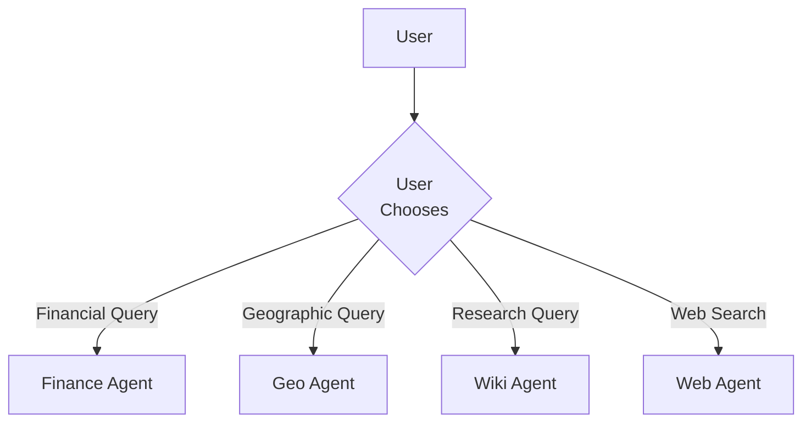
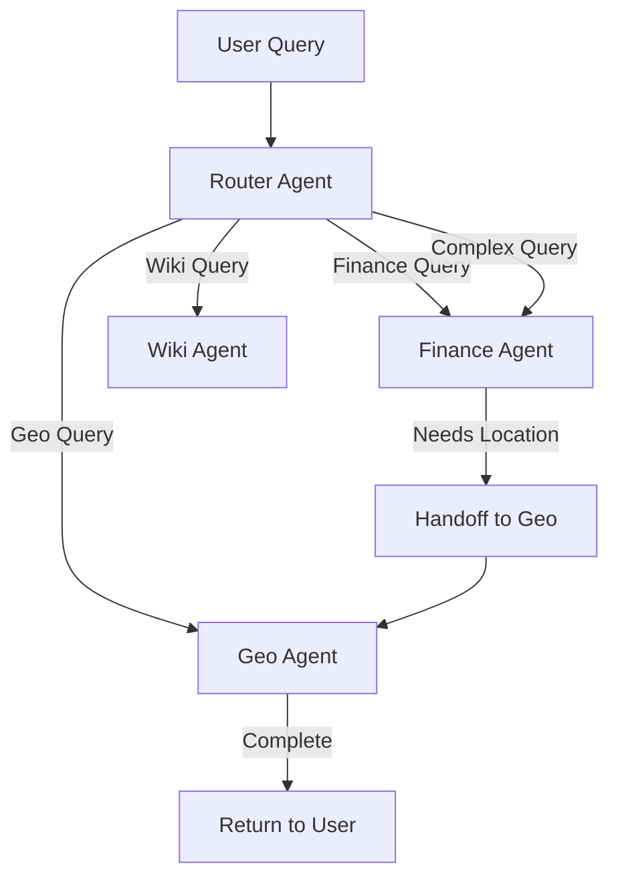
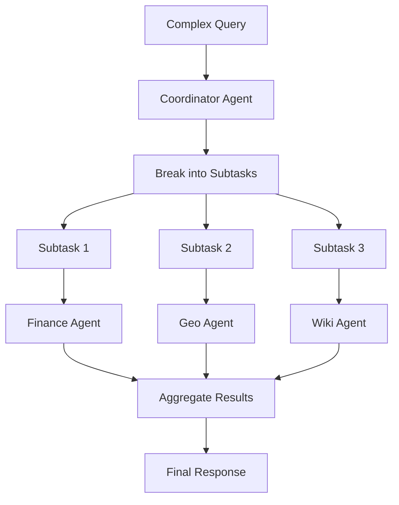
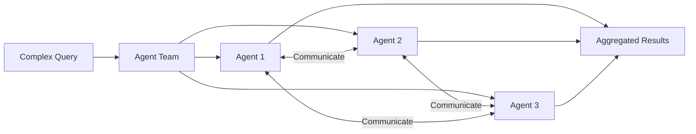

# Building Multi-Agent Systems: A Comprehensive Guide

## Introduction

This guide provides systematic approaches for building multi-agent systems using the OpenAI agents framework. It covers everything from single-agent systems to complex multi-agent orchestration patterns.

## Table of Contents

1. [System Evolution Stages](#system-evolution-stages)
2. [Building Your First Agent](#building-your-first-agent)
3. [Tool Development Guide](#tool-development-guide)
4. [Multi-Agent Coordination](#multi-agent-coordination)
5. [Advanced Patterns](#advanced-patterns)
6. [Production Considerations](#production-considerations)

---

## System Evolution Stages

Multi-agent systems typically evolve through these stages:



### Stage 1: Single Agent
**Current Status: ✅ Implemented**

- One agent with a focused set of tools
- Best for well-defined, domain-specific tasks
- Examples: Finance Agent, Geo Agent, Wiki Agent

**When to use:**
- Task domain is narrow and well-defined
- Tools are all related to the same domain
- No need for cross-domain reasoning

### Stage 2: Multiple Specialized Agents
**Current Status: ✅ Implemented**

- Collection of independent, specialized agents
- Each agent is an expert in its domain
- User manually selects which agent to use

**When to use:**
- Multiple distinct domains (finance, geography, research)
- Each domain has its own tool set
- Users know which agent they need

### Stage 3: Router Pattern
**Current Status: ✅ Implemented (SmartRouter)**

- Master agent routes queries to specialist agents
- Uses agent handoffs
- Automatic agent selection based on query
- **Configuration-driven with instructions injection**

**When to use:**
- Users don't know which agent to use
- Need seamless cross-domain experiences
- Want single entry point for all queries

**Implementation:** See [SmartRouter Guide](./smart-router.md)

### Stage 4: Hierarchical Orchestration
**Current Status: 🔮 Future**

- Coordinator breaks complex tasks into subtasks
- Multiple agents work on different subtasks
- Results aggregated by coordinator

**When to use:**
- Complex tasks requiring multiple domains
- Task decomposition is beneficial
- Need parallel execution of subtasks

### Stage 5: Autonomous Collaboration
**Current Status: 🔮 Future**

- Agents communicate and collaborate directly
- Dynamic team formation
- Self-organizing workflows

**When to use:**
- Highly complex, open-ended problems
- Unknown task structure
- Need adaptive problem-solving

---

## Building Your First Agent

### Step 1: Define the Domain

Identify a specific domain or capability:

```python
# Good domain definitions:
- "Financial market data retrieval"
- "Geographic information and geocoding"
- "Wikipedia research and article retrieval"
- "Weather information and forecasts"

# Bad domain definitions (too broad):
- "General knowledge"
- "Everything about the internet"
- "Helping users"
```

### Step 2: Identify Required Tools

List the specific operations needed:

```python
# Finance Agent Tools
tools = [
    "Get company information",
    "Get historical stock prices",
    "Get financial statements",
    "Get analyst recommendations",
    "Get news articles",
    "Compare multiple stocks"
]
```

### Step 3: Create Tool Implementations

```python
import asyncio
from typing import Dict, Any
from agents import function_tool

@function_tool
async def your_first_tool(
    param1: str,
    param2: int = 10
) -> Dict[str, Any]:
    """
    [Write a comprehensive description]

    This description is what the LLM reads to understand when
    and how to use this tool. Be detailed and specific.

    Args:
        param1: Describe what this parameter does
        param2: Describe this parameter and its default

    Returns:
        Dictionary containing:
            - field1: Description of this field
            - field2: Description of this field

    Raises:
        ValueError: When and why this is raised
        Exception: When API calls fail

    Example:
        >>> result = await your_first_tool("test", 5)
        >>> print(result)
        {'field1': 'value', 'field2': 123}
    """
    # Step 1: Validate inputs
    if not param1:
        raise ValueError("param1 cannot be empty")

    if param2 < 1:
        raise ValueError("param2 must be positive")

    try:
        # Step 2: Execute async operation
        loop = asyncio.get_running_loop()
        result = await loop.run_in_executor(
            None,
            external_api_call,
            param1,
            param2
        )

        # Step 3: Transform and validate result
        if not result:
            return {"error": "No data found"}

        return {
            "field1": result.value1,
            "field2": result.value2,
            "success": True
        }

    except SpecificException as e:
        # Handle known errors gracefully
        return {
            "error": f"Known error: {e}",
            "success": False
        }

    except Exception as e:
        # Re-raise unexpected errors with context
        raise Exception(f"Failed to process {param1}: {e}")
```

### Step 4: Create the Agent

```python
from agents import Agent, Runner, SQLiteSession

def create_your_agent() -> Agent:
    """
    Factory function for creating your specialized agent.

    Returns:
        Configured Agent instance
    """
    return Agent(
        name="Your Domain Agent",
        instructions=(
            "You are an expert in [your domain]. "
            "You have access to the following capabilities:\n\n"

            "1. Tool Name - Brief description\n"
            "2. Tool Name - Brief description\n"
            "3. Tool Name - Brief description\n\n"

            "When asked about [domain topics], use the appropriate "
            "tools to provide accurate, detailed information.\n\n"

            "Guidelines:\n"
            "- Start with [tool] for broad queries\n"
            "- Use [tool] for specific details\n"
            "- Always validate inputs before calling tools\n"
            "- Provide clear, concise responses\n\n"

            "Tips for best results:\n"
            "- [Tip 1]\n"
            "- [Tip 2]\n"
            "- [Tip 3]"
        ),
        tools=[
            your_first_tool,
            your_second_tool,
            # ... more tools
        ],
    )
```

### Step 5: Add Testing and Interaction

```python
async def main():
    """Test and interact with your agent."""
    # Initialize
    agent = create_your_agent()
    session = SQLiteSession(session_id="test_session")

    # Initial smoke test
    print("Running initial test...")
    result = await Runner.run(
        agent,
        input="Your test query here",
        session=session
    )
    print(f"Result: {result.final_output}\n")

    # Interactive loop
    print("Enter your queries (empty line to quit)")
    user_input = input("Query: ")

    while user_input.strip():
        result = await Runner.run(
            agent,
            input=user_input,
            session=session
        )
        print(f"\nResponse: {result.final_output}\n")
        user_input = input("Query: ")

if __name__ == "__main__":
    asyncio.run(main())
```

### Step 6: Directory Structure

```
asdrp/
├── actions/
│   └── your_domain/
│       ├── __init__.py
│       └── your_tools.py      # Tool implementations
└── agents/
    └── singles/
        └── your_agent.py       # Agent definition & testing
```

---

## Tool Development Guide

### Tool Design Checklist

#### ✅ Required Elements

1. **`@function_tool` decorator**: Enables LLM to use the function
2. **Type hints**: All parameters and return type
3. **Async function**: All tools must be async
4. **Comprehensive docstring**: LLM reads this
5. **Parameter validation**: Check inputs early
6. **Error handling**: Graceful failures
7. **Structured return**: Dict or Pydantic model

#### 📝 Docstring Template

```python
@function_tool
async def tool_name(param: Type) -> ReturnType:
    """
    One-line summary of what the tool does.

    Detailed description of the tool's purpose, when to use it,
    and what it accomplishes. Be specific and clear.

    Args:
        param: Detailed description of parameter, including:
            - Expected format
            - Valid values or ranges
            - Default behavior if applicable
            - Examples

    Returns:
        Description of return value structure:
            - field1: What this field contains
            - field2: What this field contains
            - field3: Optional field, when present

    Raises:
        ValueError: Specific conditions that raise this
        SpecificException: When this specific error occurs
        Exception: Generic failure cases

    Example:
        >>> result = await tool_name("example")
        >>> print(result)
        {'field1': 'value', 'field2': 123}

    Note:
        Any additional important information about usage,
        limitations, or special considerations.
    """
```

### Common Tool Patterns

#### Pattern 1: Simple Data Retrieval

```python
@function_tool
async def get_data(identifier: str) -> Dict[str, Any]:
    """Retrieve data for a given identifier."""
    if not identifier:
        raise ValueError("Identifier required")

    loop = asyncio.get_running_loop()
    data = await loop.run_in_executor(None, api.get, identifier)

    return {"identifier": identifier, "data": data}
```

#### Pattern 2: Search/Query

```python
@function_tool
async def search(
    query: str,
    limit: int = 10,
    filters: Optional[Dict[str, Any]] = None
) -> Dict[str, Any]:
    """Search for items matching query."""
    if not query:
        raise ValueError("Query required")

    if limit < 1 or limit > 100:
        raise ValueError("Limit must be between 1 and 100")

    loop = asyncio.get_running_loop()
    results = await loop.run_in_executor(
        None,
        api.search,
        query,
        limit,
        filters or {}
    )

    return {
        "query": query,
        "count": len(results),
        "results": results
    }
```

#### Pattern 3: Data Transformation

```python
@function_tool
async def transform_data(
    input_data: Dict[str, Any],
    format: str = "json"
) -> Dict[str, Any]:
    """Transform data from one format to another."""
    valid_formats = ["json", "csv", "xml"]

    if format not in valid_formats:
        raise ValueError(f"Format must be one of {valid_formats}")

    loop = asyncio.get_running_loop()
    transformed = await loop.run_in_executor(
        None,
        transformer.convert,
        input_data,
        format
    )

    return {
        "original_format": "json",
        "target_format": format,
        "data": transformed
    }
```

#### Pattern 4: Multi-Step Operation

```python
@function_tool
async def complex_operation(param: str) -> Dict[str, Any]:
    """Perform multi-step operation."""
    loop = asyncio.get_running_loop()

    # Step 1: Fetch data
    data = await loop.run_in_executor(None, api.fetch, param)

    # Step 2: Process data
    processed = await loop.run_in_executor(None, processor.run, data)

    # Step 3: Validate results
    if not processed.is_valid:
        return {"error": "Processing failed validation"}

    # Step 4: Format output
    return {
        "input": param,
        "steps_completed": 3,
        "result": processed.output,
        "metadata": processed.metadata
    }
```

### Testing Tools

#### Unit Test Template

```python
import pytest
import json
from your_module import your_tool

@pytest.mark.asyncio
async def test_tool_success():
    """Test successful execution."""
    result = await your_tool.on_invoke_tool(
        ctx=None,
        input=json.dumps({"param": "valid_value"})
    )

    parsed = json.loads(result) if isinstance(result, str) else result
    assert parsed["success"] is True
    assert "data" in parsed

@pytest.mark.asyncio
async def test_tool_validation():
    """Test parameter validation."""
    with pytest.raises(ValueError) as exc_info:
        await your_tool.on_invoke_tool(
            ctx=None,
            input=json.dumps({"param": ""})
        )
    assert "cannot be empty" in str(exc_info.value)

@pytest.mark.asyncio
async def test_tool_error_handling():
    """Test error handling."""
    with patch('module.api_call') as mock_api:
        mock_api.side_effect = Exception("API Error")

        result = await your_tool.on_invoke_tool(
            ctx=None,
            input=json.dumps({"param": "value"})
        )

        parsed = json.loads(result) if isinstance(result, str) else result
        assert "error" in parsed
```

---

## Multi-Agent Coordination

### Approach 1: Manual Agent Selection (Current)



**Implementation:**
```python
# User manually selects agent
agents = {
    "finance": create_finance_agent(),
    "geo": create_geo_agent(),
    "wiki": create_wiki_agent(),
    "web": create_web_agent(),
}

selected_agent = agents[user_choice]
result = await Runner.run(selected_agent, input=query, session=session)
```

**Pros:**
- Simple and explicit
- Full user control
- Easy to debug

**Cons:**
- User must know which agent to use
- No cross-domain queries
- Manual routing required

### Approach 2: Router Pattern with Handoffs



**Implementation:**
```python
def create_router_agent() -> Agent:
    """Router that delegates to specialist agents."""
    finance_agent = create_finance_agent()
    geo_agent = create_geo_agent()
    wiki_agent = create_wiki_agent()
    web_agent = create_web_agent()

    return Agent(
        name="Router Agent",
        instructions=(
            "You are a routing agent that delegates queries to "
            "specialized agents. Analyze the user's query and "
            "hand off to the appropriate specialist:\n\n"

            "- Finance Agent: Stock prices, financial data, market info\n"
            "- Geo Agent: Addresses, coordinates, locations\n"
            "- Wiki Agent: General knowledge, research, facts\n"
            "- Web Agent: Current events, news, weather\n\n"

            "For complex queries requiring multiple domains, "
            "coordinate between agents using handoffs."
        ),
        handoffs=[
            finance_agent,
            geo_agent,
            wiki_agent,
            web_agent,
        ],
    )

# Usage
router = create_router_agent()
session = SQLiteSession(session_id="conversation")

# Router automatically delegates
result = await Runner.run(
    router,
    input="What's the stock price of AAPL?",  # Goes to Finance
    session=session
)

result = await Runner.run(
    router,
    input="Where is the Eiffel Tower?",  # Goes to Geo → Wiki
    session=session
)
```

**Pros:**
- Single entry point
- Automatic routing
- Cross-domain coordination
- Seamless handoffs

**Cons:**
- More complex to debug
- Routing decisions visible in trace
- Requires clear agent descriptions

### Approach 3: Hierarchical Coordinator



**Implementation:**
```python
def create_coordinator_agent() -> Agent:
    """Coordinator that decomposes complex tasks."""
    return Agent(
        name="Coordinator Agent",
        instructions=(
            "You are a coordinator that breaks down complex queries "
            "into subtasks and delegates them to specialist agents.\n\n"

            "Process:\n"
            "1. Analyze the query for required information\n"
            "2. Identify which specialists are needed\n"
            "3. Create a plan for subtask execution\n"
            "4. Execute subtasks using handoffs\n"
            "5. Aggregate results into coherent response\n\n"

            "Example:\n"
            "Query: 'Compare Tesla and Apple stocks and find their headquarters'\n"
            "Plan:\n"
            "1. Get TSLA data (Finance Agent)\n"
            "2. Get AAPL data (Finance Agent)\n"
            "3. Find Tesla HQ location (Wiki Agent → Geo Agent)\n"
            "4. Find Apple HQ location (Wiki Agent → Geo Agent)\n"
            "5. Compile comparison with locations"
        ),
        handoffs=[
            create_finance_agent(),
            create_geo_agent(),
            create_wiki_agent(),
            create_web_agent(),
        ],
    )

# Usage for complex queries
coordinator = create_coordinator_agent()
result = await Runner.run(
    coordinator,
    input=(
        "Compare the stock performance of Tesla and Apple, "
        "find where their headquarters are located, and "
        "summarize their business models from Wikipedia"
    ),
    session=session
)
```

**Pros:**
- Handles complex queries
- Task decomposition
- Parallel execution potential
- Comprehensive results

**Cons:**
- Higher complexity
- More LLM calls (higher cost)
- Longer execution time
- Harder to predict behavior

### Approach 4: Autonomous Collaboration



**Implementation** (Advanced - Future):
```python
def create_collaborative_system():
    """System where agents communicate directly."""
    # Agents with peer-to-peer handoffs
    finance_agent = Agent(
        name="Finance Agent",
        handoffs=[geo_agent, wiki_agent],  # Can call peers
        instructions="Collaborate with other agents as needed..."
    )

    # Agents negotiate who handles what
    # Agents share information dynamically
    # Self-organizing workflows

    return {
        "finance": finance_agent,
        "geo": geo_agent,
        "wiki": wiki_agent,
    }
```

**Pros:**
- Highly flexible
- Adaptive to task complexity
- True collaboration
- Emergent problem-solving

**Cons:**
- Complex to implement
- Unpredictable behavior
- Difficult to debug
- High token usage

---

## Advanced Patterns

### Pattern 1: Agent with Context

```python
from dataclasses import dataclass
from typing import Optional

@dataclass
class AppContext:
    """Shared context across agent execution."""
    user_id: str
    session_id: str
    preferences: Dict[str, Any]
    history: List[str]

def create_contextual_agent() -> Agent:
    return Agent(
        name="Contextual Agent",
        instructions=lambda ctx: (
            f"User {ctx.user_id} prefers {ctx.preferences.get('style')}. "
            "Tailor responses accordingly."
        ),
        tools=[...],
    )

# Usage
context = AppContext(
    user_id="user123",
    session_id="session456",
    preferences={"style": "detailed"},
    history=[]
)

result = await Runner.run(
    agent,
    input=query,
    context=context,
    session=session
)
```

### Pattern 2: Structured Output

```python
from pydantic import BaseModel

class StockAnalysis(BaseModel):
    """Structured output for stock analysis."""
    symbol: str
    current_price: float
    recommendation: str
    confidence: float
    reasoning: str

def create_structured_agent() -> Agent:
    return Agent(
        name="Analyst Agent",
        instructions="Analyze stocks and return structured analysis",
        tools=[...],
        output_type=StockAnalysis,  # Force structured output
    )

# Agent MUST return StockAnalysis object
result = await Runner.run(agent, input="Analyze AAPL", session=session)
analysis: StockAnalysis = result.final_output
print(f"Recommendation: {analysis.recommendation}")
print(f"Confidence: {analysis.confidence}")
```

### Pattern 3: Guardrails

```python
from agents import InputGuardrail, OutputGuardrail

class ProfanityFilter(InputGuardrail):
    """Block inappropriate input."""
    async def validate(self, ctx, input):
        if contains_profanity(input):
            raise ValueError("Inappropriate input detected")
        return input

class FactCheckGuardrail(OutputGuardrail):
    """Verify output accuracy."""
    async def validate(self, ctx, output):
        if not verify_facts(output):
            raise ValueError("Fact check failed")
        return output

def create_safe_agent() -> Agent:
    return Agent(
        name="Safe Agent",
        instructions="Provide accurate, appropriate information",
        tools=[...],
        input_guardrails=[ProfanityFilter()],
        output_guardrails=[FactCheckGuardrail()],
    )
```

### Pattern 4: Agent Hooks

```python
from agents import AgentHooks

class LoggingHooks(AgentHooks):
    """Log agent execution."""

    async def on_agent_start(self, ctx, agent, input):
        log.info(f"Agent {agent.name} started with: {input}")

    async def on_tool_call(self, ctx, agent, tool, args):
        log.info(f"Calling {tool.name} with {args}")

    async def on_agent_end(self, ctx, agent, output):
        log.info(f"Agent {agent.name} completed: {output}")

def create_monitored_agent() -> Agent:
    return Agent(
        name="Monitored Agent",
        instructions="...",
        tools=[...],
        hooks=LoggingHooks(),
    )
```

---

## Production Considerations

### 1. Error Handling Strategy

```python
class ResilientAgent:
    """Production-ready agent wrapper."""

    def __init__(self, agent: Agent, max_retries: int = 3):
        self.agent = agent
        self.max_retries = max_retries

    async def run(
        self,
        input: str,
        session: Session
    ) -> Optional[RunResult]:
        """Run with retry logic and error handling."""
        for attempt in range(self.max_retries):
            try:
                result = await Runner.run(
                    self.agent,
                    input=input,
                    session=session,
                    max_turns=10
                )
                return result

            except MaxTurnsExceeded:
                log.warning(f"Max turns exceeded on attempt {attempt + 1}")
                if attempt == self.max_retries - 1:
                    return None
                continue

            except Exception as e:
                log.error(f"Error on attempt {attempt + 1}: {e}")
                if attempt == self.max_retries - 1:
                    raise
                await asyncio.sleep(2 ** attempt)  # Exponential backoff

        return None
```

### 2. Rate Limiting

```python
from asyncio import Semaphore

class RateLimitedAgent:
    """Agent with rate limiting."""

    def __init__(self, agent: Agent, max_concurrent: int = 5):
        self.agent = agent
        self.semaphore = Semaphore(max_concurrent)

    async def run(self, input: str, session: Session) -> RunResult:
        """Run with concurrency limit."""
        async with self.semaphore:
            return await Runner.run(
                self.agent,
                input=input,
                session=session
            )
```

### 3. Monitoring and Metrics

```python
import time
from dataclasses import dataclass
from typing import List

@dataclass
class AgentMetrics:
    """Track agent performance."""
    total_calls: int = 0
    total_duration: float = 0.0
    total_tokens: int = 0
    errors: int = 0
    tool_calls: Dict[str, int] = field(default_factory=dict)

class MonitoredAgent:
    """Agent with metrics tracking."""

    def __init__(self, agent: Agent):
        self.agent = agent
        self.metrics = AgentMetrics()

    async def run(self, input: str, session: Session) -> RunResult:
        """Run with metrics collection."""
        start = time.time()
        self.metrics.total_calls += 1

        try:
            result = await Runner.run(
                self.agent,
                input=input,
                session=session
            )

            # Track metrics
            self.metrics.total_duration += time.time() - start
            # Track tokens, tool calls, etc.

            return result

        except Exception as e:
            self.metrics.errors += 1
            raise

    def get_metrics(self) -> AgentMetrics:
        """Get current metrics."""
        return self.metrics
```

### 4. Session Management

```python
class SessionManager:
    """Manage agent sessions."""

    def __init__(self, session_timeout: int = 3600):
        self.sessions: Dict[str, Tuple[Session, float]] = {}
        self.timeout = session_timeout

    def get_session(self, session_id: str) -> Session:
        """Get or create session."""
        now = time.time()

        # Clean expired sessions
        self._cleanup_expired(now)

        # Get existing or create new
        if session_id in self.sessions:
            session, _ = self.sessions[session_id]
            self.sessions[session_id] = (session, now)
        else:
            session = SQLiteSession(session_id=session_id)
            self.sessions[session_id] = (session, now)

        return session

    def _cleanup_expired(self, now: float):
        """Remove expired sessions."""
        expired = [
            sid for sid, (_, last_used) in self.sessions.items()
            if now - last_used > self.timeout
        ]
        for sid in expired:
            del self.sessions[sid]
```

### 5. Configuration Management

```python
from dataclasses import dataclass
from typing import Optional
import yaml

@dataclass
class AgentConfig:
    """Agent configuration."""
    name: str
    model: str = "gpt-4"
    max_turns: int = 10
    temperature: float = 0.7
    max_tokens: Optional[int] = None
    tools: List[str] = field(default_factory=list)

class ConfigurableAgent:
    """Agent built from configuration."""

    @classmethod
    def from_config(cls, config_path: str) -> Agent:
        """Load agent from YAML config."""
        with open(config_path) as f:
            config_dict = yaml.safe_load(f)

        config = AgentConfig(**config_dict)

        # Load tools by name
        tools = [TOOL_REGISTRY[name] for name in config.tools]

        return Agent(
            name=config.name,
            instructions=load_instructions(config.name),
            tools=tools,
            model=config.model,
            model_settings=ModelSettings(
                temperature=config.temperature,
                max_tokens=config.max_tokens,
            ),
        )
```

### 6. Testing Strategy

```python
# Unit tests: Test tools independently
@pytest.mark.asyncio
async def test_tool_function():
    result = await tool.on_invoke_tool(ctx=None, input=test_input)
    assert result is not None

# Integration tests: Test agent workflows
@pytest.mark.asyncio
async def test_agent_workflow():
    agent = create_agent()
    session = SQLiteSession(session_id="test")
    result = await Runner.run(agent, input="test query", session=session)
    assert result.final_output is not None

# End-to-end tests: Test multi-agent systems
@pytest.mark.asyncio
async def test_multi_agent_system():
    router = create_router()
    session = SQLiteSession(session_id="test")

    # Test routing to different agents
    finance_result = await Runner.run(
        router,
        input="Stock price of AAPL",
        session=session
    )
    assert "AAPL" in finance_result.final_output

    geo_result = await Runner.run(
        router,
        input="Coordinates of Paris",
        session=session
    )
    assert "France" in geo_result.final_output
```

---

## Migration Guide: Upgrading to Instructions Injection

### Overview

Modern multi-agent systems use **instructions injection** to separate behavior (prompts) from logic (code). This section guides you through upgrading existing agents.

### For Existing Agents

#### Step 1: Update Agent Imports

```python
# Add these imports
from typing import Optional
from asdrp.agents.base import AgentBuilder
```

#### Step 2: Extract Instructions to Constant

```python
# Before: Instructions hardcoded in Agent()
def create_my_agent() -> Agent:
    return Agent(
        name="My Agent",
        instructions="You are a helpful assistant...",  # ❌ Hardcoded
        tools=[tool1, tool2],
    )

# After: Extract to module constant
DEFAULT_INSTRUCTIONS = """
You are a helpful assistant that specializes in X, Y, and Z.

Your capabilities:
- Capability 1
- Capability 2
- Capability 3

Use your tools to provide accurate information.
""".strip()

TOOLS = [tool1, tool2, tool3]
```

#### Step 3: Update Factory Signature

```python
def create_my_agent(
    model: str = "gpt-4.1-mini",
    temperature: Optional[float] = 0.0,
    instructions: Optional[str] = None  # ✨ NEW: Accept injected instructions
) -> Agent:
    """
    Create agent with dependency injection support.

    Args:
        model: LLM model to use (injected from config)
        temperature: Temperature setting (injected from config)
        instructions: System prompt (injected from config or uses default)

    Returns:
        Configured Agent instance
    """
    return AgentBuilder.create(
        name="My Agent",
        instructions=instructions or DEFAULT_INSTRUCTIONS,  # ✅ Injection support
        tools=TOOLS,
        model=model,
        temperature=temperature,
    )
```

#### Step 4: Add to Configuration

Create/update `config/agents.yaml`:

```yaml
agents:
  - id: my_agent
    name: My Agent
    module: asdrp.agents.singles.my_agent
    factory: create_my_agent
    model: gpt-4.1-mini
    temperature: 0.0
    instructions: |
      You are a helpful assistant that specializes in X, Y, and Z.

      Your capabilities:
      - Capability 1
      - Capability 2
      - Capability 3

      Use your tools to provide accurate information.
      [You can now modify this without touching Python code!]
    description: >
      Short description for routing decisions.
    capabilities:
      - Capability 1
      - Capability 2
    keywords:
      - keyword1
      - keyword2
    examples:
      - "Example query 1"
      - "Example query 2"
```

### For New Agents

Follow the modern pattern from the start:

```python
from typing import Optional
from asdrp.agents.base import AgentBuilder

DEFAULT_INSTRUCTIONS = """
Your agent's system prompt.
"""

TOOLS = [tool1, tool2]

def create_new_agent(
    model: str = "gpt-4.1-mini",
    temperature: Optional[float] = 0.0,
    instructions: Optional[str] = None
) -> Agent:
    return AgentBuilder.create(
        name="New Agent",
        instructions=instructions or DEFAULT_INSTRUCTIONS,
        tools=TOOLS,
        model=model,
        temperature=temperature,
    )
```

### Benefits After Migration

✅ **Zero-Code Updates**: Modify prompts via YAML
✅ **A/B Testing**: Test different prompts easily
✅ **Environment-Specific**: Different configs for dev/prod
✅ **Version Control**: Track prompt changes in git
✅ **Centralized**: All prompts in one file

### Example Use Cases

#### Modifying Agent Behavior

**Before Migration:**
```python
# Must edit Python code
instructions = "Old prompt that needs updating..."
```

**After Migration:**
```yaml
# Just edit YAML config
instructions: |
  New improved prompt...
```

#### A/B Testing Prompts

```yaml
# config-a.yaml (Conservative approach)
- id: finance
  instructions: |
    You are a conservative financial analyst...

# config-b.yaml (Aggressive approach)
- id: finance
  instructions: |
    You are an aggressive growth investor...
```

```python
# Switch configs without code changes
router_a = create_smart_router("config-a.yaml")
router_b = create_smart_router("config-b.yaml")
```

#### Environment-Specific Configurations

```
config/
├── agents.yaml              # Default
├── agents.dev.yaml          # Development (verbose prompts)
├── agents.staging.yaml      # Staging (balanced)
└── agents.prod.yaml         # Production (optimized)
```

```python
import os

env = os.getenv("ENVIRONMENT", "prod")
config_file = f"config/agents.{env}.yaml"
router = create_smart_router(config_file)
```

---

## Summary: Best Practices

### ✅ Do

1. **Start Simple**: Begin with single-purpose agents
2. **Use Instructions Injection**: System prompts in config, not code
3. **Use AgentBuilder**: Consistent agent construction pattern
4. **Validate Early**: Check inputs before expensive operations
5. **Document Thoroughly**: LLMs read your docstrings
6. **Handle Errors Gracefully**: Return error objects, don't just crash
7. **Use Type Hints**: Help both LLMs and developers
8. **Test Incrementally**: Unit → Integration → E2E
9. **Monitor in Production**: Track metrics and errors
10. **Version Your Prompts**: Track changes in git

### ❌ Don't

1. **Don't Create Mega-Agents**: Keep agents focused
2. **Don't Block Event Loop**: Use executors for I/O
3. **Don't Ignore Errors**: Handle all exceptions
4. **Don't Skip Documentation**: Docstrings are critical
5. **Don't Hardcode Config**: Use environment variables
6. **Don't Forget Rate Limits**: Respect API limits
7. **Don't Skip Testing**: Test tools and agents thoroughly
8. **Don't Over-Engineer**: Start simple, add complexity when needed

### 🚀 Evolution Path

```
1. Single Agent → Works well for one domain
2. Multiple Agents → User chooses agent manually
3. Router Agent → Automatic agent selection
4. Coordinator → Complex task decomposition
5. Collaboration → Agents work together autonomously
```

Start at level 1-2, evolve to 3-4 as needs grow, reach level 5 only for complex systems requiring it.
