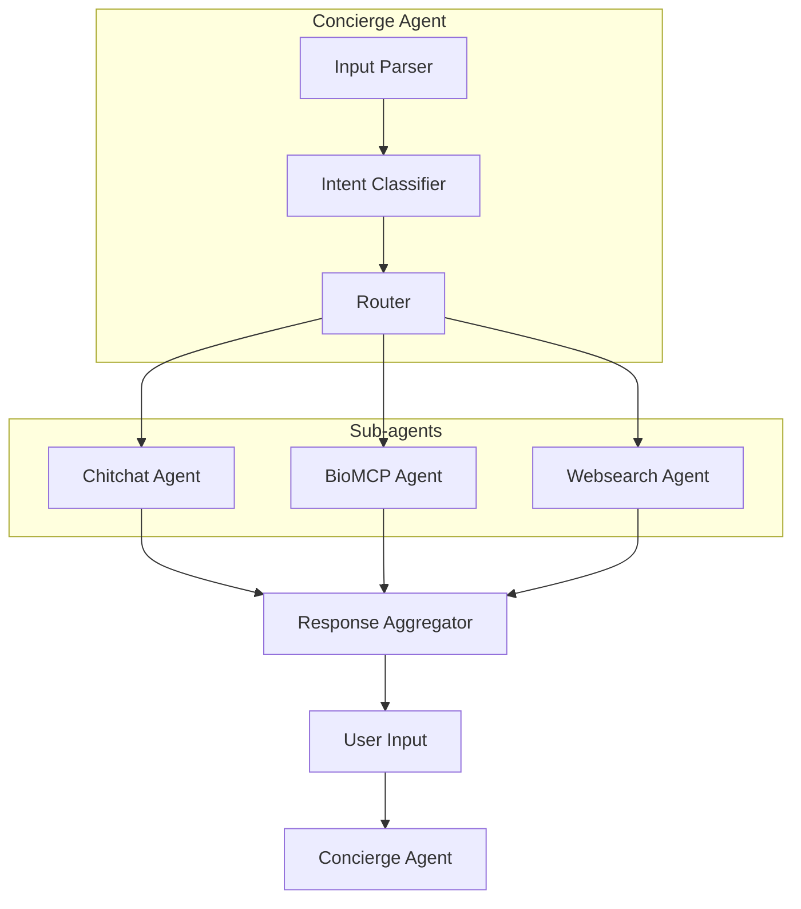

# Bio Reasoning Project


## Environment Setup

Before running any program here, we need to do basic lib imports at the toplevel of this project.  We are also activating the `bioagent` virtual environment here:

```
uv sync
source .venv/bin/activate
```

In order to run the `bioagents` module, we need to set the following env variable at the toplevel:

```
export PYTHONPATH="`pwd`"
```

## Running Streamlit

To run the web app after activating the virtual environment, at the toplevel, type:

```
streamlit run bioreasoning.py
```


## Agent Graph Design

The initial project has a simple "Agent Graph" design:




---
If you have any questions, please contact Theodore Mui <theodoremui@gmail.com>
